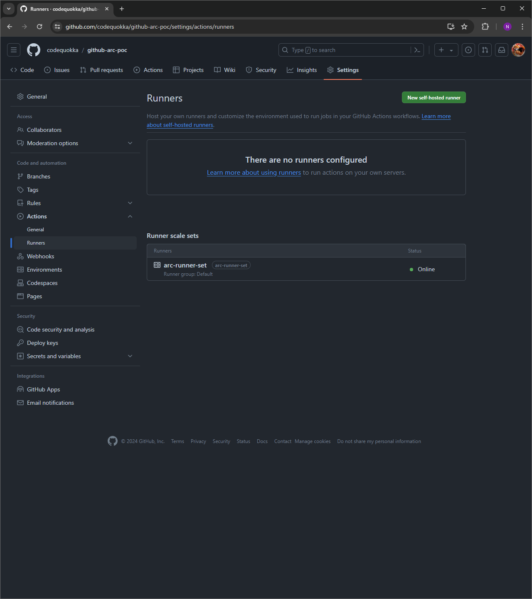

# Deploy the Github ARC

## How to deploy
- Install helm plugins
```bash
❯ task install-helm-plugin
<omit>

❯ task check-helm-plugins-are-installed
task: [check-helm-plugins-are-installed] helm plugin list | egrep '^diff'
diff    3.12.5          Preview helm upgrade changes as a diff
task: [check-helm-plugins-are-installed] helm plugin list | egrep '^secrets'
secrets 4.7.0-dev       This plugin provides secrets values encryption for Helm charts secure storing
```

- Create your encryption key
```bash
❯ task generate-encryption-key
task: [generate-encryption-key] age-keygen -o key.txt
Public key: <your-public-key>
```

- Create sops setting file
```bash
❯ vi .sops.yaml
```
```yaml
creation_rules:
  - age: <your-public-key>
```

- Set your Github repo
```bash
❯ vi github-arc/values-arc-runner-set-poc.yaml
```

```yaml
githubConfigUrl: https://github.com/<your-github-user>/<your-github-repo>
```

- Set your Github PAT
```bash
❯ rm github-arc/secrets-arc-runner-set-poc.yaml

❯ vi github-arc/secrets-arc-runner-set-poc.yaml
```

```yaml
githubConfigSecret:
    github_token: <your-github-pat>
```

```bash
❯ helm secrets encrypt -i github-arc/secrets-arc-runner-set-poc.yaml
```

- Deploy github ARC with helmfile
```bash
❯ helmfile diff -e $HELM_ENVIRONMENT
<omit>

❯ helmfile apply -e $HELM_ENVIRONMENT
<omit>
```

- Check github ARC is deployed
```bash
❯ kubectl get pods -n arc-systems
NAME                                             READY   STATUS    RESTARTS   AGE
arc-runner-set-754b578d-listener                 1/1     Running   0          3m24s
arc-systems-gha-rs-controller-547c844bc9-mb2fq   1/1     Running   0          34m
```




## How to undeploy
<!-- TODO -->
